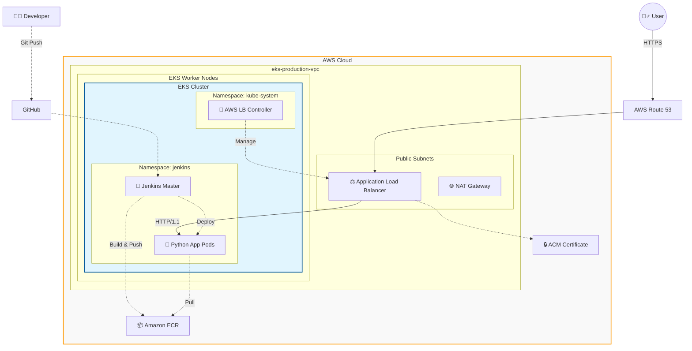

## EKS 기반 클라우드 네이티브 애플리케이션 아키텍처 및 CI/CD 구축
AWS EKS와 Terraform을 활용하여 가용성과 확장성을 갖춘 인프라를 구축하고, Jenkins를 통해 자동화된 배포 파이프라인을 구현한 프로젝트입니다.

--- 

### Project Overview
이 프로젝트는 **Infrastructure as Code(IaC)**를 통해 클라우드 리소스를 관리하고, 현대적인 **DevOps** 실무를 적용하는 데 초점을 맞추었습니다. 단순 배포를 넘어 모니터링, 보안 그리고 실제 운영환경에서 발생할 수 있는 네트워크 병목 현상을 해결하는 과정을 포함합니다.

**Tech Stack**
- **Cloud**: AWS (VPC, EKS, ECR, Rout53, ACM, IAM)
- **IaC**: Terraform (v1.x)
- **Orchestration**: Kubernetes (Amazon EKS)
- **CI/CD**: Jenkins, Helm
- **Ingress**: AWS Load Balancer Controller (ALB)
- **Language/App**: Python (FastAPI/Uvicorn), Docker

---

### System Architecture
1. **VPC**: Public/Private Subnet 분리 및 NAT Gateway를 통한 보안 강화.
2. **EKS**: Managed Node Group을 활용한 가용성 확보.
3. **ALB Controller**: Ingress를 통해 수신되는 트래픽을 파드로 로드밸런싱.
4. **Route53 & ACM**: 사용자 정의 도메인 연결 및 SSL/TLS 인증서를 통한 HTTPS 암호화.

**1. 네트워크 및 보안 인프라 (VPC Layer)**
- **VPC 구조**: 보안을 위해 **Public Subnet**과 **Private Subnet**으로 분리했습니다.
- **Public Subnet**: 외부 인터넷과 통신해야 하는 **ALB**와 Private 망의 인스턴스가 인터넷으로 나갈 수 있게 해주는 **NAT Gateway**가 위치합니다.
- **Private Subnet**: 실제 애플리케이션이 구동되는 **EKS 워커 노드**들을 배치하여 외부의 직접적인 접근을 차단하고 보안성을 높였습니다.

**2. 런타임 트래픽 흐름 (User Flow -실선)**
1. 사용자가 도메인으로 접속하면 **Route 53**이 **ALB**로 트래픽을 전달합니다.
2. **ALB**는 **ACM**과 연동하여 HTTPS 인증 처리하고, 안전한 트래픽만 내부로 들여보냅니다.
3. ALB는 EKS 내부의 **Service**리소스를 통해 **Python App Pod**로 트래픽을 로드밸런싱합니다. (이 과정에서 발생한 HTTP/2 vs HTTP/1.1 프로토콜 충돌 문제를 Ingress 설정으로 해결했습니다.)

**3. CI/CD 및 관리 흐름 (Management Flow -점섬)**
1. **배포 파이프라인**: 개발자가 코드를 Git에 푸시하면 **Jenkins**가 이를 감지하여 도커 이미지를 빌드하고 **ECR**에 푸시합니다. 이후 Helm등을 이용해 EKS의 애플리케이션을 업데이트합니다.
2. **ALB 컨트롤러의 역할**: `kube-system`에 있는 **AWS Load Balancer Controller**는 항상 K8s API를 감시합니다. 우리가 **Ingress**리소스를 생성하면, 컨트롤러가 이를 감지하고 AWS의 실제 **ALB**를 자동으로 생성하고 설정합니다. (이 과정에서 IAM 권한 문제와 VPC ID 불일치 문제를 해결했습니다.)

   
---

### Key Implementation
**1. Infrastructure as Code (Terraform)**
- VPC 및 서브넷 아키텍처 설계 (Terraform Module 활용).
- EKS 클러스터 및 IAM Role for Service Account (IRSA) 구축.
- `force_delete` 및 `lifecycle`관리를 통한 리소스 관리 최적화.

**2. CI/CD Pipline (Jenkins)**
- Helm을 이용한 Jenkins 클러스터 내 배포
- **Pipline-as-Code**: Jenkinsfile을 통한 빌드 -> 이미지 푸시(ECR) -> 배포(K8s) 자동화.
- EBS CSI Driver를 통해 Jenkins 데이터 영구 저장 (Persistence).

---

### Deep Dive: Troubleshooting & Problem Solving
이 프로젝트의 핵심은 배포 과정에서 발생한 복잡한 기술적 문제를 해결한 과정에 있습니다.
**Issue 1: IAM 권한 충돌 및 버전 관리 문제**
- **문제**: AWS Load Balancer Controller가 서브넷을 찾지 못하는 `UnauthorizedOperation` 발생
- **원인**: 구버전 IAM 정책 사용으로 인한 `ec2:DescribeRouteTables`등 필수 권한 누락.
- **해결**: 최신 정책 버전으로 업데이트 시도 중 `LimitExceeded (5개 제한)` 발생 확인 -> 미사용 정책 버전 삭제 후 최신 버전 반영으로 해결

**Issue 2: Cross-VPC 통신 및 VPC ID 불일치**
- **문제**: 컨트롤러가 보안 그룹을 찾지 못하는 `InvalidGroup.NotFound` 에러.
- **원인**: Helm 설치 시 클러스터의 실제 VPC ID가 아닌 Defualt VPC를 참조함.
- **해결**: `aws eks describe-cluster`를 통해 실제 네트워크 구조를 확인하고, 인프라 동기화를 통해 정합성 확보.

**Issue 3: 504 Gateway Timeout (HTTP/2 vs HTTP/1.1 프로토콜 충돌)**
- **문제**: 도메인 연결 성공 후 브라우저 접속 시 504 Gateway Timeout 발생.
- **디버깅**: Pod 로그에서 `Invalid HTTP request (PRI * HTTP/2.0)` 발견.
- **원인**: ALB는 HTTP/2로 통신을 시도했으나, 백엔드(Python/Uvicorn)는 HTTP/1.1만 수용 가능하여 패킬 드랍 발생.
- **해결**: Ingress Annotation을 통해 `backend-protocol-version: HTTP1`을 명시하여 프로토콜 협상 성공 및 서비스 정상화.

---

### 향후 개선
- **Observability**: Prometheus & Grafana를 활용한 클러스터 메트릭 시각화.
- **Security**: HashiCorp Vault를 연동한 시크릿 관리 고도화.
- **GitOps**: ArgoCD를 도입하여 선언적 배포 프로세스 구축.

---

## Ahthor
- **Name**: 이지현
- **Role**: DevOps Engineer / Full Stack Developer
- **Contact**: [GitHub Link](https://github.com/lee951109), [Blog](https://velog.io/@lee951109/posts)