## EKS 기반 클라우드 네이티브 애플리케이션 아키텍처 및 CI/CD 구축
AWS EKS와 Terraform을 활용하여 가용성과 확장성을 갖춘 인프라를 구축하고, Jenkins를 통해 자동화된 배포 파이프라인을 구현한 프로젝트입니다.

--- 

### Project Overview
이 프로젝트는 **AWS EKS(K8s)** 기반의 고가용성 인프라를 구축하고, **CI/CD(Jenkins)** 및 **Observability(Prometheus/Grafana)** 시스템까지 T**erraform 코드로 완전 자동화**한 DevOps 플랫폼입니다.

단순한 클러스터 구축을 넘어, 실제 운영 환경에서 필요한 **도메인 연결(Route53)**, **HTTPS 보안(ACM)**, **ALB**그리고 **통합 모니터링 시스템**을 구축하여 안정성을 확보했습니다. 특히, 수동으로 관리되던 애플리케이션 설정을 Terraform으로 통합하여 **"명령어 한 줄로 전체 인프라와 애플리케이션이 빠르게 복구되는 재해 복구 환경**을 구현했습니다.

---

### System Architecture
사용자 트래픽 처리(Traffic Flow), 배포 파이프라인(Deploy Flow), 그리고 리소스 모니터링(Monitoring Flow)이 유기적으로 결합된 아키텍처입니다.

```mermaid
graph TD
    %% 사용자 및 관리자
    User((🙋‍♂️ User)) -->|HTTPS/443| R53[AWS Route 53]
    Admin((👷‍♂️ DevOps)) -->|Terraform Apply| EKS_API[EKS Control Plane]

    subgraph AWS_Cloud [AWS Cloud ap-northeast-2]
        ACM[🔒 ACM Certificate]
        ECR[📦 Amazon ECR]

        subgraph VPC [eks-production-vpc]
            subgraph Public_Subnets [Public Subnets]
                ALB[⚖️ AWS ALB]
                NAT[🌐 NAT Gateway]
            end

            subgraph Private_Subnets [Private Subnets - Worker Nodes]
                
                subgraph K8s_Cluster [EKS Cluster]
                    
                    subgraph Ingress_Layer [Ingress Controller]
                        LBC[🤖 AWS LB Controller]
                    end

                    subgraph App_Layer [Namespace: jenkins]
                        Jenkins[🤵 Jenkins Master]
                        App[🐍 Python App]
                    end

                    subgraph Monitoring_Layer [Namespace: monitoring]
                        Prometheus[🔥 Prometheus]
                        Grafana[📊 Grafana]
                    end
                end
            end
        end
    end

    %% 트래픽 흐름
    R53 --> ALB
    ALB -.->|SSL Offloading| ACM
    ALB -->|Routing Rules| Jenkins
    ALB -->|Routing Rules| Grafana
    ALB -->|Routing Rules| App

    %% 모니터링 흐름
    Prometheus -.->|Scrape Metrics| Jenkins
    Prometheus -.->|Scrape Metrics| App
    Prometheus -.->|Scrape Metrics| K8s_Cluster
    Grafana -->|Query| Prometheus

    %% 배포 흐름
    Jenkins -->|Build & Push| ECR
    Jenkins -->|Deploy| App
    LBC -.->|Provision| ALB

    %% 스타일링
    style AWS_Cloud fill:#f9f9f9,stroke:#FF9900,stroke-width:2px
    style Monitoring_Layer fill:#fff3e0,stroke:#e65100,stroke-dasharray: 5 5
    style App_Layer fill:#e3f2fd,stroke:#1565c0
```


**🔍 Architecture Highlights**

1. **Traffic Flow (User → App)**: Route53과 ALB를 거쳐 EKS 내부의 Jenkins, Grafana, App으로 트래픽이 라우팅됩니다. ACM을 통해 전 구간 HTTPS 암호화를 적용했습니다.

2. **Monitoring Flow (Prometheus → Grafana)**: Prometheus가 클러스터 노드, 파드, Jenkins의 메트릭을 수집(Scrape)하고, EBS 볼륨에 영구 저장합니다. Grafana는 이를 시각화하여 대시보드로 제공합니다.

3. **Management Flow (Terraform → Infra)**: VPC, EKS뿐만 아니라 Helm Chart(Jenkins, Prometheus) 설정까지 Terraform이 통합 관리하여 설정 불일치(Drift)를 방지합니다.
   
---

### Tech Stack
| Category   | Technology            | Usage                                                                 |
|------------|-----------------------|-----------------------------------------------------------------------|
| IaC        | Terraform             | 인프라(VPC, EKS) 및 애플리케이션(Helm Release) 통합 관리             |
| Cluster    | Amazon EKS            | Managed Node Group, OIDC, EBS CSI Driver 구성                        |
| CI/CD      | Jenkins               | Pipeline-as-Code, Docker Build & Push, K8s Deploy 자동화             |
| Monitoring | Prometheus & Grafana  | kube-prometheus-stack 활용, 리소스 사용량 및 빌드 성능 모니터링      |
| Network    | ALB & Route53         | AWS Load Balancer Controller 기반 Ingress 구축, 도메인 연결          |
| Security   | IAM & ACM             | IRSA(IAM Roles for Service Accounts) 적용, SSL 인증서 자동 갱신      |


---
### 📂 Infrastructure as Code (Directory Structure)
기존의 수동 YAML 매니페스트 관리 방식을 탈피하고, 모듈화된 Terraform 구조로 리팩토링했습니다.
```bash
infra-iac/
├── provider.tf        # AWS, Helm, Kubernetes 프로바이더 중앙 관리 (버전 충돌 방지)
├── vpc.tf             # 네트워크 계층 (Public/Private Subnet, NAT Gateway)
├── eks.tf             # EKS 클러스터 및 Add-on (EBS CSI, Load Balancer Controller)
├── jenkins.tf         # [NEW] Jenkins 설치 및 Ingress 설정 통합 (YAML 제거)
├── monitoring.tf      # [NEW] Prometheus/Grafana 스택 및 도메인 연결 자동화
├── iam.tf             # IAM Role, Policy, IRSA 설정
├── route53_acm.tf     # 도메인 및 SSL 인증서 자동 발급
└── variables.tf       # 재사용성을 위한 변수 관리
```
---

### 💡 Deep Dive: Troubleshooting & Problem Solving
단순 구현이 아닌, 운영 수준의 안정성을 확보하기 위해 해결한 주요 기술적 이슈들입니다.

**Issue 1: Terraform Provider 의존성 충돌 및 스키마 오류 (Critical)**
- **상황**: 수동으로 관리하던 헬름 차트를 Terraform으로 이관하는 중 `Unexpected block: set` 및 `Inconsistent dependency lock file` 에러 발생.
- **원인**: 여러 `.tf` 파일에 `provider "helm"` 설정이 파편화되어 있었고, EKS 모듈의 인증 정보가 Helm 프로바이더에 올바르게 전달되지 않음.
- **해결**:
1. `provider.tf` 파일을 신설하여 프로바이더 설정을 중앙 집중화하고 버전을 명시.
2. 에러가 잦은 `set` 블록 대신 `yamlencode`**를 활용한** `values` **블록 방식**으로 코드를 전면 리팩토링하여 안정성 확보.
3. `terraform init -upgrade`를 통해 꼬인 의존성 트리를 재정렬하여 해결.

**Issue 2: 인프라와 애플리케이션의 라이프사이클 불일치**
- **상황**: `terraform destroy` 시, AWS Load Balancer Controller가 삭제되기 전 Ingress 리소스가 남아있어 ALB가 고아(Orphaned) 리소스로 남는 문제.
- **해결**: Terraform의 리소스 의존성 그래프를 분석하여, `monitoring.tf`와 `jenkins.tf`의 헬름 리리스가 삭제된 후 컨트롤러가 삭제되도록 순서를 보장. 또한, 수동 삭제 스크립트를 작성하여 잔존 리소스 비용 발생 차단.

**Issue 3: 504 Gateway Timeout (HTTP/2 프로토콜 충돌)**
- **상황**: 도메인 연결 성공 후 브라우저 접속 시 504 에러 발생. Pod 로그에서 `Invalid HTTP request (PRI * HTTP/2.0)` 확인.
- **원인**: ALB는 기본적으로 HTTP/2로 통신을 시도하나, 백엔드 앱(Python)은 HTTP/1.1만 지원하여 패킷 드랍 발생.
- **해결**: Ingress Annotation에 `backend-protocol-version: HTTP1`을 명시하여 프로토콜 협상 강제화.
---

**📝 Retrospective**
이번 프로젝트를 통해 **"작동하는 인프라"**를 넘어 **"관리 가능한 인프라"**를 구축했습니다. 특히 수동으로 관리하던 애플리케이션 영역을 Terraform으로 흡수하면서 발생한 `provider` 충돌 문제를 해결하며 IaC 도구의 동작 원리를 깊이 이해하게 되었습니다. 향후에는 ArgoCD를 도입하여 GitOps 방식으로 CD 파이프라인을 고도화할 계획입니다.

---

## Ahthor
- **Name**: 이지현
- **Role**: DevOps Engineer / Full Stack Developer
- **Contact**: [GitHub Link](https://github.com/lee951109), [Blog](https://velog.io/@lee951109/posts)